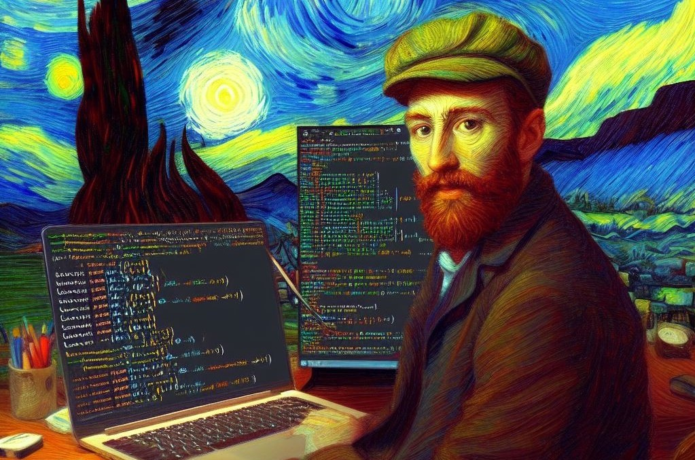

# Numerical methods using fsharp

_Fsharp makes it easy to use numerical methods even for Van Gogh_

This repository provides a brief overview of some common numerical methods used in scientific computing and mathematical problem solving, implemented in the F# functional language.

## Methods

### Newton-Raphson Method

- Used to find roots of nonlinear equations.

### Bisection Method

- Another technique to find roots of equations, especially useful when working with continuous functions on closed intervals.

### Interpolation and Regression

- Techniques to estimate intermediate values between known data points (interpolation) or to fit a curve to a dataset (regression).

### Euler's Method and Runge-Kutta Methods

- Used to solve ordinary differential equations, which model changes in variables over time.

### LU Decomposition

- Used to solve systems of linear equations, especially useful for large matrices.

### Jacobi Method and Gauss-Seidel Method

- Iterative methods for solving systems of linear equations.

### Singular Value Decomposition (SVD)

- Used in linear algebra to factorize matrices into products of simple matrices and is fundamental in techniques like dimensionality reduction.

### Fourier Transform

- Used to transform signals between the time domain and the frequency domain, essential in signal processing and dynamic systems analysis.

### Monte Carlo Method

- A statistical-numerical approach for simulation and problem-solving through the generation of random numbers.

### Finite Element Method

- Used to solve engineering and physics problems, especially for structural and thermal analysis.

### Optimization Methods

- Include techniques like gradient descent to find minima or maxima of functions.

## Contributions

Feel free to contribute! If you have additional methods you'd like to add or improve existing descriptions, create a pull request, and I'll be happy to review it.
